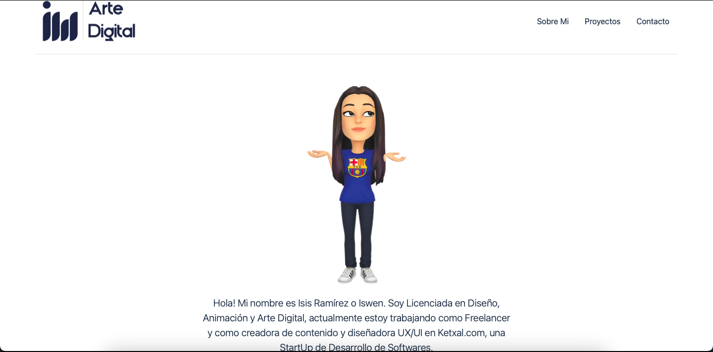
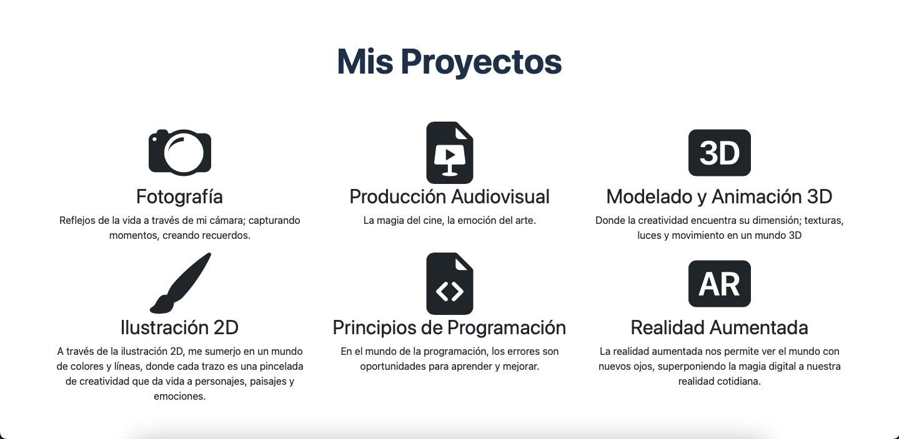
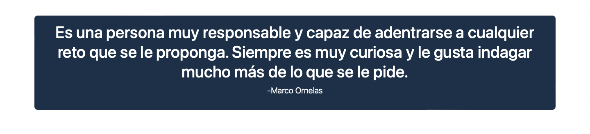
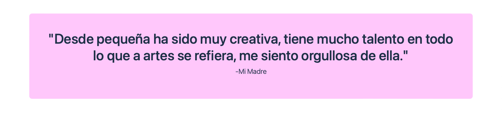
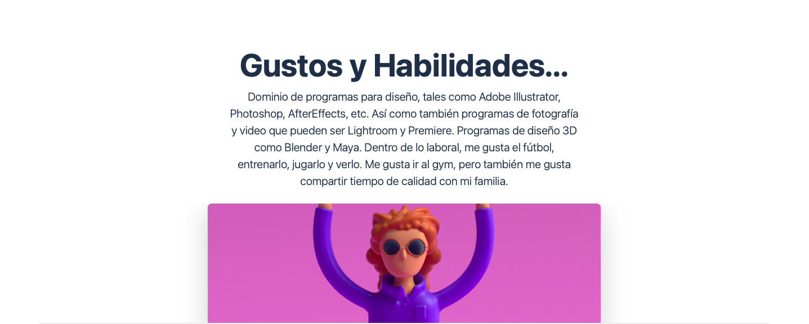
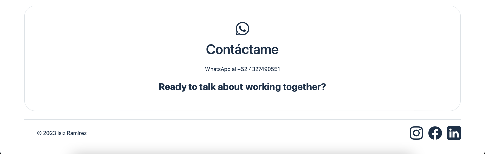

# Portafolio Personal: Tecnolochicas PRO

Este proyecto fue creado durante el bootcamp Technolochicas PRO, es una página web responsiva (adaptable a diversos dispositivos).

El proposito de la creación de este sitio web es mostrar el portafolio de proyectos de la desarrolladora y su experiencia alrededor del área, que incluye: sobre mi, proyectos, contactos, etc.

## Uso
Puedes navegar en el entrando al link que aparecerá acontinuación:

[MiPortafolio](https://splendorous-starburst-d31314.netlify.app/)

## Secciones (Capturas de Pantalla)

### Sobre Mi:

### Mis Proyectos:

### Testimonios:

### Gustos y Habilidades:

### Contacto:

# Tecnologías 
1. HTML
2. CSS
3. JavaScript

# Instalación 

No requiere de instalación para este proyecto, ya que se trata de un sitio web.

